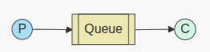

# Hands\-on RabbitMQ learning with Ruby on Rails

Excited to share a small hands\-on Rails project for learning RabbitMQ patterns.

## Summary

- A compact Ruby on Rails demo that teaches five core RabbitMQ messaging patterns: Single queue, Work queue, Fanout, Direct/Routing, Topic, and Headers.  
- Purpose-specific controllers and concise examples in [rabbitmq_overview.md](docs/rabbitmq_overview.md).

## Brief project details

- **Structure:** Each pattern has its own controller and service classes so you can focus on one pattern at a time (e.g., `SingleQueueController`, `WorkQueueController`, `PubSubController` with direct/topic subroutes).  
- **Hands\-on exercises:** Step-by-step `curl` commands in this `README.md` to start subscribers/publishers and observe behavior locally.  
- **Exchanges and queues:** Demonstrates Fanout (broadcast), Direct (exact routing), Topic (wildcards: `*` and `#`), and Headers (`x-match`) with practical examples.  
- **Testing & environment:** Includes RSpec examples and integration checks; run RabbitMQ locally with `docker compose up` and execute the provided specs or manual checks.  
- **Who it’s for:** Developers learning messaging, microservices, or integrating RabbitMQ with Rails who want runnable examples and quick experiments.

See `README.md` and `docs/rabbitmq_overview.md` for how to get started and the full exercise list.
## RabbitMQ Example Usage

This Rails application demonstrates all five common RabbitMQ messaging patterns with clearly named, purpose-specific classes.

See: [rabbitmq_overview.md](docs/rabbitmq_overview.md) for concise code examples of each pattern.

## Project Structure for Learning

Each RabbitMQ messaging pattern has its own dedicated controller and namespace:

- **SingleQueueController** - `/single_queue/*` - Simplest case, 1 producer 1 consumer
- **WorkQueueController** - `/work_queues/*` - Task distribution
- **PubSubController** - `/pub_sub/*` - Fanout, Direct (routing), Topic and Headers exchanges (various pub/sub patterns)

This separation makes it easy to understand each pattern independently.

## Terminology clarification
- "Publish/Subscribe" (pub/sub) is a broad family of messaging patterns where producers (publishers) send messages to exchanges and multiple consumers (subscribers) can receive them. The common exchange types covered in this project are:
  - Fanout (broadcast to all bound queues)
  - Direct (exact routing key match — often shown in routing examples)
  - Topic (pattern matching with wildcards — often shown in topic examples)
  - Headers (matching based on message headers)

- For clarity: Routing (direct exchange) and Topic (topic exchange) are specific flavors of pub/sub routing. This project keeps dedicated controllers for RoutingController and TopicController to make those flavors easier to study independently, but they are conceptually part of the broader publish/subscribe family.

## Architecture Overview

### Single Queue Pattern (`SingleQueueController`): The simplest thing that does something
- https://www.rabbitmq.com/tutorials/tutorial-one-ruby
- **RabbitmqSingleQueue** - Enqueues messages to a single queue
- **RabbitmqSingleConsumer** - Consumes messages from the queue
- Messages sent to a specific queue (`demo_queue`)
- Good for: Simple use cases, learning, when only one consumer should process messages

  

### Work Queue Pattern (`WorkQueueController`): Distributing tasks among workers (the competing consumers pattern)
- https://www.rabbitmq.com/tutorials/tutorial-two-ruby
- **Rabbitmq::Queue::WorkQueue** - Enqueues work tasks to specific queues
- **Rabbitmq::Queue::WorkQueueJob** - Workers that process tasks from queues
- Messages sent to a specific queue (`demo_queue`)
- Multiple workers compete for tasks (load balancing)
- Each task processed by exactly one worker
- Good for: Task distribution, job processing.

    

### Fanout Pattern (`PubSubController` - Fanout exchange): Broadcasting to many consumers
- https://www.rabbitmq.com/tutorials/tutorial-three-ruby
- `Rabbitmq::Exchange::Publisher` — publishes to exchanges
- `Rabbitmq::Exchange::Subscriber` — subscribes to exchanges

Fanout (`demo_exchange`)
- Summary: broadcast message copies to all bound queues.
- Good for:
  - System-wide announcements (maintenance, feature flags)
  - Broadcasting events to multiple independent consumers (logging, metrics, notification services)
  - Stateless subscribers that must all receive every message

  

### Routing Pattern (`RoutingController`): Receiving messages selectively
- NOTE: routing examples are now provided under the pub_sub namespace as the Direct pattern (`/pub_sub/direct/*`). See the Pub/Sub — Direct section and /pub_sub/direct endpoints.

### Topic Pattern (`TopicController`): Receiving messages based on a pattern (topics)
- NOTE: topic examples are now provided under the pub_sub namespace as the Topic pattern (`/pub_sub/topic/*`). See the Pub/Sub — Topic section and /pub_sub/topic endpoints.

### Headers Pattern (`PubSubController`): Header-based routing (x-match)
- Summary: route based on message headers and `x-match` (`all` / `any`).
- Good for:
  - Complex routing decisions based on multiple metadata fields (locale, tenant, version)
  - When routing depends on attributes instead of a routing key
  - Selective delivery requiring combinations of header values

  (See docs/rabbitmq_overview.md for the headers example code)

## Learning Exercise Examples

### Exercise 1: Single Queue
**Automated Tests**: Unit tests for controller and services
```bash
# Run automated tests
bundle exec rspec spec/controllers/single_queue_controller_spec.rb

# Manual verification
# Terminal 1: Start consumer
curl -X POST http://localhost:3000/single_queue/start_consumer -d "consumer_name=consumer_1"

# Terminal 2: Send message
curl -X POST http://localhost:3000/single_queue/enqueue -d "message=Hello, Single Queue!"

# Observe: consumer_1 receives the message
```

### Exercise 2: Work Queue
**Automated Tests**: Integration spec verifies message distribution among workers
```bash
# Run automated tests
bundle exec rspec spec/integration/work_queue_integration_spec.rb
bundle exec rspec spec/controllers/work_queues_controller_spec.rb

# Manual verification - demonstrate task distribution among competing workers:
# Terminal 1: Start first worker
curl -X POST http://localhost:3000/work_queues/start_worker \
  -d "worker_name=worker_1"

# Terminal 2: Start second worker  
curl -X POST http://localhost:3000/work_queues/start_worker \
  -d "worker_name=worker_2"

# Terminal 3: Send multiple tasks
curl -X POST http://localhost:3000/work_queues/enqueue -d "message=Task 1"
curl -X POST http://localhost:3000/work_queues/enqueue -d "message=Task 2"
curl -X POST http://localhost:3000/work_queues/enqueue -d "message=Task 3"

# Observe: Tasks are distributed between worker_1 and worker_2
```

### Exercise 3: Fanout Broadcasting
**Automated Tests**: Integration spec verifies all subscribers receive messages
```bash
# Run automated tests
bundle exec rspec spec/integration/pub_sub_integration_spec.rb
bundle exec rspec spec/controllers/pub_sub/fanout_controller_spec.rb

# Manual verification - show how all subscribers receive the same message:
# Terminal 1: Start email service subscriber
curl -X POST http://localhost:3000/pub_sub/fanout/start_subscriber \
  -d "subscriber_name=email_service"

# Terminal 2: Start SMS service subscriber
curl -X POST http://localhost:3000/pub_sub/fanout/start_subscriber \
  -d "subscriber_name=sms_service"

# Terminal 3: Broadcast message
curl -X POST http://localhost:3000/pub_sub/fanout/broadcast \
  -d "message=System will be down for maintenance"

# Observe: Both email_service and sms_service receive the same message
```

### Exercise 4: Routing
**Automated Tests**: Integration spec verifies exact routing key matching
```bash
# Run automated tests
bundle exec rspec spec/integration/direct_integration_spec.rb
bundle exec rspec spec/controllers/pub_sub/direct_controller_spec.rb

# Manual verification - demonstrate selective message routing by exact match:
# Terminal 1: Subscribe to error notifications (direct exchange)
curl -X POST http://localhost:3000/pub_sub/direct/start_subscriber \
  -d "subscriber_name=error_handler" -d "routing_key=error.critical"

# Terminal 2: Subscribe to info notifications (direct exchange)
curl -X POST http://localhost:3000/pub_sub/direct/start_subscriber \
  -d "subscriber_name=info_handler" -d "routing_key=info"

# Terminal 3: Publish messages (direct exchange)
curl -X POST http://localhost:3000/pub_sub/direct/publish \
  -d "message=Critical system error" -d "routing_key=error.critical"

curl -X POST http://localhost:3000/pub_sub/direct/publish \
  -d "message=Informational message" -d "routing_key=info"

# Observe routing:
# - error_handler gets "Critical system error"
# - info_handler gets "Informational message"
```

### Exercise 5: Topic Routing
**Automated Tests**: Integration spec verifies routing pattern matching
```bash
# Run automated tests
bundle exec rspec spec/integration/topic_integration_spec.rb
bundle exec rspec spec/controllers/pub_sub/topic_controller_spec.rb

# Manual verification - demonstrate selective message routing by pattern:
# Terminal 1: Subscribe to user events (topic exchange)
curl -X POST http://localhost:3000/pub_sub/topic/start_subscriber \
  -d "subscriber_name=user_service" -d "routing_pattern=user.*"

# Terminal 2: Subscribe to order events (topic exchange)
curl -X POST http://localhost:3000/pub_sub/topic/start_subscriber \
  -d "subscriber_name=order_service" -d "routing_pattern=order.*"

# Terminal 3: Subscribe to all error events (topic exchange)
curl -X POST http://localhost:3000/pub_sub/topic/start_subscriber \
  -d "subscriber_name=error_service" -d "routing_pattern=*.error"

# Terminal 4: Send different events (topic exchange)
curl -X POST http://localhost:3000/pub_sub/topic/publish -d "message=New user John" -d "routing_key=user.created"

curl -X POST http://localhost:3000/pub_sub/topic/publish -d "message=Order completed" -d "routing_key=order.completed"

curl -X POST http://localhost:3000/pub_sub/topic/publish -d "message=Payment failed" -d "routing_key=payment.error"

# Observe routing:
# - user_service gets "user.created"
# - order_service gets "order.completed" 
# - error_service gets "payment.error"
```

### Exercise 6: Headers Exchange
**Automated Tests**: Controller and service tests for header-based routing
```bash
# Run automated tests
bundle exec rspec spec/controllers/pub_sub/headers_controller_spec.rb

# Manual verification - demonstrate header-based message routing:
# Terminal 1: Start headers subscriber
curl -X POST -d 'subscriber_name=reports&headers={"x-match":"all","type":"report"}' http://localhost:3000/pub_sub/headers/start_subscriber

# Terminal 2: Publish headers message
curl -X POST -d 'message=monthly_report&headers={"type":"report","format":"json"}' http://localhost:3000/pub_sub/headers/publish

# Observe: reports subscriber receives the message based on header matching
```
