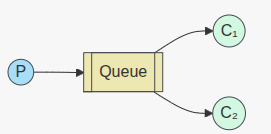
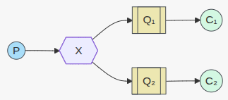

# README

This README would normally document whatever steps are necessary to get the
application up and running.

Things you may want to cover:

* Ruby version

* System dependencies

* Configuration

* Database creation

* Database initialization

* How to run the test suite

* Services (job queues, cache servers, search engines, etc.)

* Deployment instructions

## RabbitMQ Example Usage

This Rails application demonstrates all five common RabbitMQ messaging patterns with clearly named, purpose-specific classes.

See: [rabbitmq_overview.md](docs/rabbitmq_overview.md) for concise code examples of each pattern.

## Project Structure for Learning

Each RabbitMQ messaging pattern has its own dedicated controller and namespace:

- **SingleQueueController** - `/single_queue/*` - Simplest case, 1 producer 1 consumer
- **WorkQueueController** - `/work_queue/*` - Task distribution
- **PubSubController** - `/pub_sub/*` - Fanout, Direct (routing), Topic and Headers exchanges (various pub/sub patterns)

This separation makes it easy to understand each pattern independently.

## Terminology clarification
- "Publish/Subscribe" (pub/sub) is a broad family of messaging patterns where producers (publishers) send messages to exchanges and multiple consumers (subscribers) can receive them. The common exchange types covered in this project are:
  - Fanout (broadcast to all bound queues)
  - Direct (exact routing key match — often shown in routing examples)
  - Topic (pattern matching with wildcards — often shown in topic examples)
  - Headers (matching based on message headers)

- For clarity: Routing (direct exchange) and Topic (topic exchange) are specific flavors of pub/sub routing. This project keeps dedicated controllers for RoutingController and TopicController to make those flavors easier to study independently, but they are conceptually part of the broader publish/subscribe family.

## Architecture Overview

### Single Queue Pattern (`SingleQueueController`): The simplest thing that does something
- https://www.rabbitmq.com/tutorials/tutorial-one-ruby
- **RabbitmqSingleQueue** - Enqueues messages to a single queue
- **RabbitmqSingleConsumer** - Consumes messages from the queue
- Messages sent to a specific queue (`demo_queue`)
- Good for: Simple use cases, learning, when only one consumer should process messages

  

### Work Queue Pattern (`WorkQueueController`): Distributing tasks among workers (the competing consumers pattern)
- https://www.rabbitmq.com/tutorials/tutorial-two-ruby
- **Rabbitmq::Queue::WorkQueue** - Enqueues work tasks to specific queues
- **Rabbitmq::Queue::WorkQueueJob** - Workers that process tasks from queues
- Messages sent to a specific queue (`demo_queue`)
- Multiple workers compete for tasks (load balancing)
- Each task processed by exactly one worker
- Good for: Task distribution, job processing.

    

### Fanout Pattern (`PubSubController` - Fanout exchange): Broadcasting to many consumers
- https://www.rabbitmq.com/tutorials/tutorial-three-ruby
- `Rabbitmq::Exchange::Publisher` — publishes to exchanges
- `Rabbitmq::Exchange::Subscriber` — subscribes to exchanges

Fanout (`demo_exchange`)
- Summary: broadcast message copies to all bound queues.
- Good for:
  - System-wide announcements (maintenance, feature flags)
  - Broadcasting events to multiple independent consumers (logging, metrics, notification services)
  - Stateless subscribers that must all receive every message

  

### Routing Pattern (`RoutingController`): Receiving messages selectively
- NOTE: routing examples are now provided under the pub_sub namespace as the Direct pattern (`/pub_sub/direct/*`). See the Pub/Sub — Direct section and /pub_sub/direct endpoints.

### Topic Pattern (`TopicController`): Receiving messages based on a pattern (topics)
- NOTE: topic examples are now provided under the pub_sub namespace as the Topic pattern (`/pub_sub/topic/*`). See the Pub/Sub — Topic section and /pub_sub/topic endpoints.

### Headers Pattern (`PubSubController`): Header-based routing (x-match)
- Summary: route based on message headers and `x-match` (`all` / `any`).
- Good for:
  - Complex routing decisions based on multiple metadata fields (locale, tenant, version)
  - When routing depends on attributes instead of a routing key
  - Selective delivery requiring combinations of header values

  (See docs/rabbitmq_overview.md for the headers example code)

## API Endpoints (Learning-Focused)

Below are the HTTP endpoints provided by the demo app. Note: some examples are available both as generic "pub_sub" endpoints (which show multiple exchange types from one controller) and as dedicated controller endpoints under `/routing` and `/topic` kept for focused study.

### Single Queue Pattern
```bash
# Send message to single queue
curl -X POST http://localhost:3000/single_queue/enqueue \
  -H "Content-Type: application/json" \
  -d '{"message": "Hello, RabbitMQ!"}'

# Start a consumer for the queue
curl -X POST http://localhost:3000/single_queue/start_consumer \
  -H "Content-Type: application/json" \
  -d '{"consumer_name": "consumer_1"}'
```

### Work Queue Pattern
```bash
# Send work task to queue
curl -X POST http://localhost:3000/work_queue/enqueue \
  -H "Content-Type: application/json" \
  -d '{"message": "Process order #1234"}'

# Start a worker to process tasks
curl -X POST http://localhost:3000/work_queue/start_worker \
  -H "Content-Type: application/json" \
  -d '{"worker_name": "order_processor"}'
```

### Pub/Sub — Fanout (via PubSubController)
```bash
# Broadcast to all subscribers (fanout exchange)
curl -X POST http://localhost:3000/pub_sub/fanout/broadcast \
  -H "Content-Type: application/json" \
  -d '{"message": "System maintenance starting"}'

# Start a subscriber (receives all broadcasts)
curl -X POST http://localhost:3000/pub_sub/fanout/start_subscriber \
  -H "Content-Type: application/json" \
  -d '{"subscriber_name": "email_service"}'
```

### Pub/Sub — Direct (Routing) (via PubSubController)
```bash
# Publish to direct exchange (demo helper)
curl -X POST http://localhost:3000/pub_sub/direct/publish \
  -H "Content-Type: application/json" \
  -d '{"message": "Critical system error", "routing_key": "error.critical"}'

# Start a direct subscriber (demo helper)
curl -X POST http://localhost:3000/pub_sub/direct/start_subscriber \
  -H "Content-Type: application/json" \
  -d '{"subscriber_name": "error_handler", "routing_key": "error.critical"}'
```

### Pub/Sub — Topic (via PubSubController)
```bash
# Publish to topic exchange (demo helper)
curl -X POST http://localhost:3000/pub_sub/topic/publish \
  -H "Content-Type: application/json" \
  -d '{"message": "User registered", "routing_key": "user.created"}'

# Start a topic subscriber (demo helper)
curl -X POST http://localhost:3000/pub_sub/topic/start_subscriber \
  -H "Content-Type: application/json" \
  -d '{"subscriber_name": "user_service", "routing_pattern": "user.*"}'
```

### Pub/Sub — Headers (via PubSubController)
```bash
# Publish to headers exchange (provide a JSON object for headers)
curl -X POST http://localhost:3000/pub_sub/headers/publish \
  -H "Content-Type: application/json" \
  -d '{"message": "Report ready", "headers": {"type": "report", "locale": "en-US"}}'

# Start a headers subscriber (binds using provided headers)
curl -X POST http://localhost:3000/pub_sub/headers/start_subscriber \
  -H "Content-Type: application/json" \
  -d '{"subscriber_name": "report_service", "headers": {"x-match": "all", "type": "report"}}'
```

### Routing Controller (Direct — focused examples)
- Note: The dedicated /routing endpoints were consolidated under the pub_sub namespace to avoid duplication. Use the pub_sub/direct endpoints below instead.

Mapping:
- `/routing/publish` -> `/pub_sub/direct/publish`
- `/routing/start_subscriber` -> `/pub_sub/direct/start_subscriber`

### Topic Controller (Topic — focused examples)
- Note: The dedicated /topic endpoints were consolidated under the pub_sub namespace to avoid duplication. Use the pub_sub/topic endpoints below instead.

Mapping:
- `/topic/publish` -> `/pub_sub/topic/publish`
- `/topic/start_subscriber` -> `/pub_sub/topic/start_subscriber`

Note: the demo app intentionally exposes both "pub_sub" helper endpoints that demonstrate multiple exchange types and dedicated "routing"/"topic" controllers that isolate those flavors for learning. Use whichever set matches the exercise you are following.

## Learning Exercise Examples

### Exercise 1: Single Queue
Demonstrate basic message publishing and consumption:

```bash
# Terminal 1: Start consumer
curl -X POST http://localhost:3000/single_queue/start_consumer \
  -d '{"consumer_name": "consumer_1"}'

# Terminal 2: Send message
curl -X POST http://localhost:3000/single_queue/enqueue -d '{"message": "Hello, Single Queue!"}'

# Observe: consumer_1 receives the message
```

### Exercise 2: Work Queue
Demonstrate task distribution among competing workers:

```bash
# Terminal 1: Start first worker
curl -X POST http://localhost:3000/work_queue/start_worker \
  -d '{"worker_name": "worker_1"}'

# Terminal 2: Start second worker  
curl -X POST http://localhost:3000/work_queue/start_worker \
  -d '{"worker_name": "worker_2"}'

# Terminal 3: Send multiple tasks
curl -X POST http://localhost:3000/work_queue/enqueue -d '{"message": "Task 1"}'
curl -X POST http://localhost:3000/work_queue/enqueue -d '{"message": "Task 2"}'
curl -X POST http://localhost:3000/work_queue/enqueue -d '{"message": "Task 3"}'

# Observe: Tasks are distributed between worker_1 and worker_2
```

### Exercise 3: Fanout Broadcasting
Show how all subscribers receive the same message:

```bash
# Terminal 1: Start email service subscriber
curl -X POST http://localhost:3000/pub_sub/fanout/start_subscriber \
  -d '{"subscriber_name": "email_service"}'

# Terminal 2: Start SMS service subscriber
curl -X POST http://localhost:3000/pub_sub/fanout/start_subscriber \
  -d '{"subscriber_name": "sms_service"}'

# Terminal 3: Broadcast message
curl -X POST http://localhost:3000/pub_sub/fanout/broadcast \
  -d '{"message": "System will be down for maintenance"}'

# Observe: Both email_service and sms_service receive the same message
```

### Exercise 4: Routing
Demonstrate selective message routing by exact match:

```bash
# Terminal 1: Subscribe to error notifications (direct exchange)
curl -X POST http://localhost:3000/pub_sub/direct/start_subscriber \
  -d '{"subscriber_name": "error_handler", "routing_key": "error.critical"}'

# Terminal 2: Subscribe to info notifications (direct exchange)
curl -X POST http://localhost:3000/pub_sub/direct/start_subscriber \
  -d '{"subscriber_name": "info_handler", "routing_key": "info"}'

# Terminal 3: Publish messages (direct exchange)
curl -X POST http://localhost:3000/pub_sub/direct/publish \
  -d '{"message": "Critical system error", "routing_key": "error.critical"}'

curl -X POST http://localhost:3000/pub_sub/direct/publish \
  -d '{"message": "Informational message", "routing_key": "info"}'

# Observe routing:
# - error_handler gets "Critical system error"
# - info_handler gets "Informational message"
```

### Exercise 5: Topic Routing
Demonstrate selective message routing by pattern:

```bash
# Terminal 1: Subscribe to user events (topic exchange)
curl -X POST http://localhost:3000/pub_sub/topic/start_subscriber \
  -d '{"subscriber_name": "user_service", "routing_pattern": "user.*"}'

# Terminal 2: Subscribe to order events (topic exchange)
curl -X POST http://localhost:3000/pub_sub/topic/start_subscriber \
  -d '{"subscriber_name": "order_service", "routing_pattern": "order.*"}'

# Terminal 3: Subscribe to all error events (topic exchange)
curl -X POST http://localhost:3000/pub_sub/topic/start_subscriber \
  -d '{"subscriber_name": "error_service", "routing_pattern": "*.error"}'

# Terminal 4: Send different events (topic exchange)
curl -X POST http://localhost:3000/pub_sub/topic/publish \
  -d '{"message": "New user John", "routing_key": "user.created"}'

curl -X POST http://localhost:3000/pub_sub/topic/publish \
  -d '{"message": "Order completed", "routing_key": "order.completed"}'

curl -X POST http://localhost:3000/pub_sub/topic/publish \
  -d '{"message": "Payment failed", "routing_key": "payment.error"}'

# Observe routing:
# - user_service gets "user.created"
# - order_service gets "order.completed" 
# - error_service gets "payment.error"
```

## Class Structure (Educational)

### Single Queue Classes
```ruby
Rabbitmq::Queue::Publisher.publish(queue_name, message)     # Send message to single queue
Rabbitmq::Queue::WorkQueueJob.new.perform(queue_name)       # Consume message from queue
```

### Work Queue Classes
```ruby
Rabbitmq::Queue::WorkQueue.enqueue(queue_name, message)     # Send work to queue
Rabbitmq::Queue::WorkQueueJob.new.perform(queue_name)       # Process work from queue
```

### Pub/Sub Classes
```ruby
# Publishing
Rabbitmq::Exchange::Publisher.broadcast('demo_exchange', 'hello world')                    # Fanout
Rabbitmq::Exchange::Publisher.publish_topic('demo_topic_exchange', 'kern.critical', 'msg')   # Topic

# Subscribing
Rabbitmq::Exchange::Subscriber.subscribe_to_exchange('demo_exchange', 'subscriber_name')        # Fanout
Rabbitmq::Exchange::Subscriber.subscribe_to_topic('demo_topic_exchange', 'kern.*', 'subscriber_name')  # Topic
```

### Routing Classes
```ruby
# Publishing
Rabbitmq::Exchange::Publisher.publish_direct('demo_direct_exchange', 'error.critical', 'critical msg')   # Direct exchange

# Subscribing
Rabbitmq::Exchange::Subscriber.subscribe_to_direct('demo_direct_exchange', 'error.critical', 'subscriber_name')  # Direct exchange
```

### Topic Classes
```ruby
# Publishing
Rabbitmq::Exchange::Publisher.publish_topic('demo_topic_exchange', 'user.created', 'user created')   # Topic exchange

# Subscribing
Rabbitmq::Exchange::Subscriber.subscribe_to_topic('demo_topic_exchange', 'user.*', 'subscriber_name')  # Topic exchange
```

## Running the Learning Environment
```bash
docker-compose up 
```


3. Use the exercises above or API endpoints to learn each pattern

## Running tests and checks for each RabbitMQ pattern

This project includes a few automated specs (integration/service) and manual checks you can run locally. All automated tests that interact with RabbitMQ require RabbitMQ to be running (use Docker Compose below).

1) Start RabbitMQ (in background)

```bash
# from project root
docker compose up
```

2) Run the tests for each pattern

- Single Queue (1P → 1C)
  - Automated: service spec that verifies publishing to a queue
    ```bash
    bundle exec rspec spec/services/rabbitmq_producer_spec.rb
    ```
  - Manual quick check:
    ```bash
    # start a consumer in one terminal (background thread via controller or rails runner)
    curl -X POST -d "consumer_name=consumer_1" http://localhost:3000/single_queue/start_consumer

    # send a message from another terminal
    curl -X POST -d "message=hello_single" http://localhost:3000/single_queue/enqueue
    ```

- Work Queue (1P → many Cs — competing consumers)
  - Automated integration spec:
    ```bash
    bundle exec rspec spec/integration/work_queue_integration_spec.rb
    ```
  - Manual quick check:
    ```bash
    # start two workers (separate terminals)
    curl -X POST -d "worker_name=worker_1" http://localhost:3000/work_queue/start_worker
    curl -X POST -d "worker_name=worker_2" http://localhost:3000/work_queue/start_worker

    # enqueue tasks
    curl -X POST -d "message=task1" http://localhost:3000/work_queue/enqueue
    curl -X POST -d "message=task2" http://localhost:3000/work_queue/enqueue
    ```

- Publish/Subscribe (Fanout)
  - Automated integration spec:
    ```bash
    bundle exec rspec spec/integration/pub_sub_integration_spec.rb
    ```
  - Manual quick check:
    ```bash
    # start multiple subscribers
    curl -X POST -d "subscriber_name=sub1" http://localhost:3000/pub_sub/fanout/start_subscriber
    curl -X POST -d "subscriber_name=sub2" http://localhost:3000/pub_sub/fanout/start_subscriber

    # broadcast a message
    curl -X POST -d "message=hello_all" http://localhost:3000/pub_sub/fanout/broadcast
    ```

- Routing (Direct exchange — exact routing key)
  - No dedicated automated spec included by default. Manual check:
    ```bash
    # start subscribers with routing keys
    curl -X POST -d "subscriber_name=errors&routing_key=error.critical" http://localhost:3000/pub_sub/direct/start_subscriber
    curl -X POST -d "subscriber_name=infos&routing_key=info" http://localhost:3000/pub_sub/direct/start_subscriber

    # publish messages
    curl -X POST -d "message=critical_error&routing_key=error.critical" http://localhost:3000/pub_sub/direct/publish
    curl -X POST -d "message=just_info&routing_key=info" http://localhost:3000/pub_sub/direct/publish
    ```

- Topics (Topic exchange — pattern matching)
  - No dedicated automated spec included by default. Manual check:
    ```bash
    # start topic subscribers
    curl -X POST -d "subscriber_name=user_svc&routing_pattern=user.*" http://localhost:3000/topic/start_subscriber
    curl -X POST -d "subscriber_name=all&routing_pattern=#" http://localhost:3000/topic/start_subscriber

    # publish topic messages
    curl -X POST -d "message=new_user&routing_key=user.created" http://localhost:3000/topic/publish
    ```

3) Run all tests

```bash
# run full test suite (will include fast unit tests and any integration specs you have)
bundle exec rspec
```

Notes
- Integration specs that require RabbitMQ will fail if RabbitMQ is not running or reachable. Use `docker compose ps` to confirm the rabbitmq service is up.
- The controllers in this project start subscribers/workers in background threads for demo purposes. For reliable long-running workers run the namespaced job class in separate processes (rails runner or dedicated worker processes).

## Key Learning Points

| Controller | Pattern | Key Concept | When to Use |
|------------|---------|-------------|-------------|
| **SingleQueueController** | Single Queue | Simple pub/sub | One-off tasks, demos |
| **WorkQueueController** | Work Queue | Task distribution | Background jobs, load balancing |
| **PubSubController** | Fanout, Direct, Topic, Headers | Broadcasting, selective delivery | System notifications, event-driven architecture |
| **PubSub::DirectController** | Direct (Routing) | Selective delivery | Exact match filtering |
| **PubSub::TopicController** | Topic | Selective routing | Event-driven architecture, microservices |

## Environment Variables

- `RABBITMQ_HOST` - RabbitMQ server hostname (default: localhost)

This structure makes it easy to learn each RabbitMQ pattern independently by focusing on one controller at a time.
