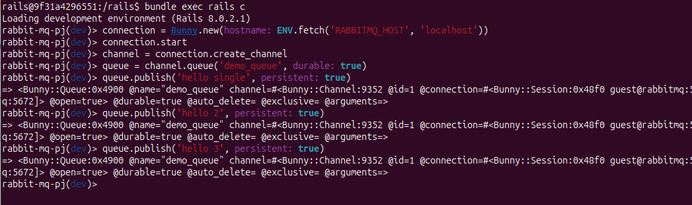
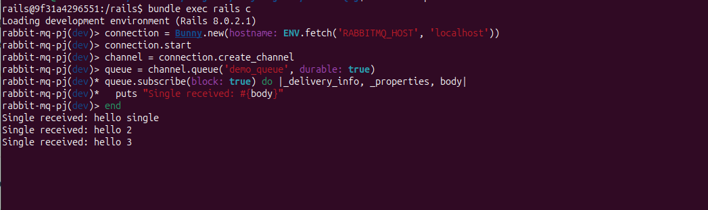
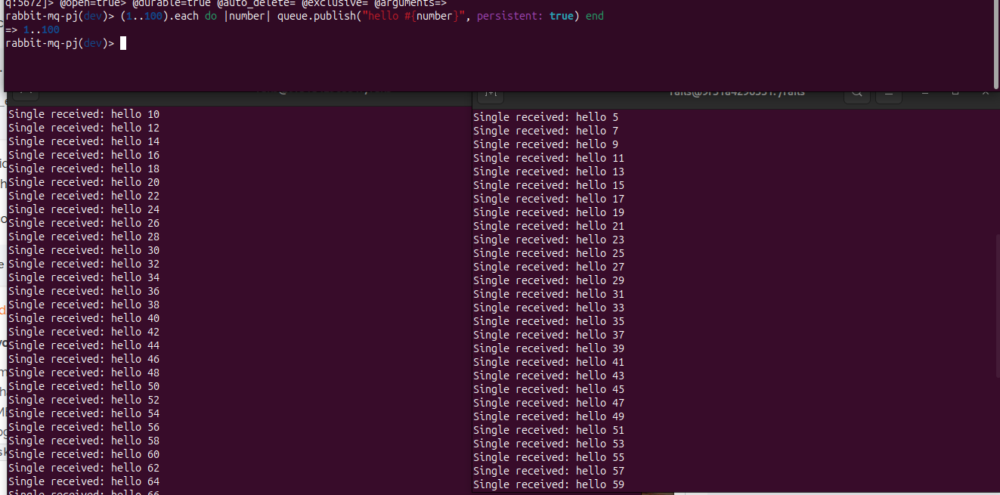
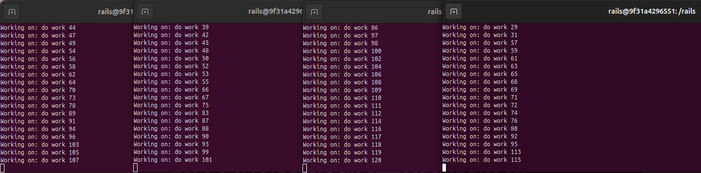
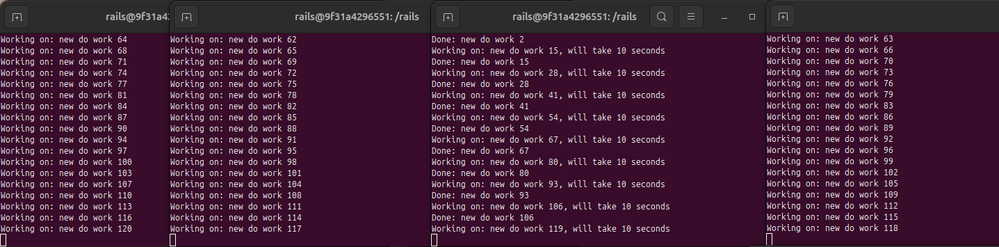
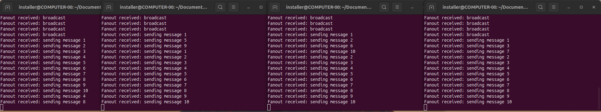
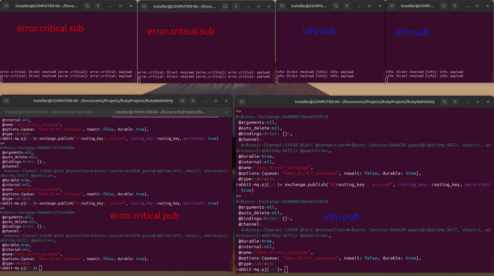

# RabbitMQ Overview: Enqueue and Receive Examples

This file provides concise Ruby (Bunny) examples showing how messages are enqueued and received for each RabbitMQ
pattern used in this project.

## Terminology clarification
- "Publish/Subscribe" (pub/sub) is the general family where publishers send messages to exchanges and multiple subscribers receive them via queues bound to those exchanges.
- Exchange types shown in this doc (and the project):
  - Fanout — broadcast to all bound queues (covered by PubSubController examples)
  - Direct — exact routing key match (covered by pub_sub/direct examples — PubSub::DirectController)
  - Topic — wildcard pattern routing (covered by pub_sub/topic examples — PubSub::TopicController)
  - Headers — matching based on message headers

- Note: Direct (routing) and Topic are flavors of the publish/subscribe family; this project groups those flavors under the pub_sub namespace with pattern-specific controllers for clearer separation of concerns.

## Log into web container

```bash
  sh rails_console.sh
```

## Single queue (direct to a named queue)

```ruby
# Enqueue
connection = Bunny.new(hostname: ENV.fetch('RABBITMQ_HOST', 'localhost'))
connection.start
channel = connection.create_channel
queue = channel.queue('demo_queue', durable: true)
queue.publish('hello single', persistent: true)
# connection.close # Close when done sending

# Receive
connection = Bunny.new(hostname: ENV.fetch('RABBITMQ_HOST', 'localhost'))
connection.start
channel = connection.create_channel
# Without fair dispatch (no prefetch, no manual ack): Receive messages as they arrive, even if busy
# Not recommended for long tasks since one busy consumer can block others
# Fair dispatch (with prefetch + manual ack) is shown in "Work queue" example
queue = channel.queue('demo_queue', durable: true)
queue.subscribe(block: true) do |_delivery_info, _properties, body|
  puts "Single received: #{body}"
end
```

### When 1 receiver is running




### When 2 receivers are running (messages distributed round-robin)



## Work queue (task distribution; consumer uses prefetch + manual ack)

```ruby
# Enqueue (same as single queue)
connection = Bunny.new(hostname: ENV.fetch('RABBITMQ_HOST', 'localhost'))
connection.start
channel = connection.create_channel
queue = channel.queue('work_queue', durable: true)
queue.publish('do work', persistent: true)
# connection.close

# Worker (consumer)
connection = Bunny.new(hostname: ENV.fetch('RABBITMQ_HOST', 'localhost'))
connection.start
channel = connection.create_channel
# fair dispatch: request new message only when ready
channel.prefetch(1) # fair dispatch - one message at a time
queue = channel.queue('work_queue', durable: true)
queue.subscribe(manual_ack: true, block: true) do |delivery_info, _properties, body|
  begin
    channel.ack(delivery_info.delivery_tag)
    puts "Done: #{body}"
  rescue
    channel.nack(delivery_info.delivery_tag, false, true)
  end
end
```

### When receivers are idle, messages are distributed round-robin

[]

### When one worker is busy, the other gets the next message



## Pub/Sub pattern

### Fanout exchange (broadcast)

```ruby
# Enqueue (publish to fanout exchange)
connection = Bunny.new(hostname: ENV.fetch('RABBITMQ_HOST', 'localhost'))
connection.start
channel = connection.create_channel
exchange = channel.fanout('demo_exchange', durable: true)
exchange.publish('broadcast', persistent: true)
# connection.close

# Subscriber (each subscriber gets its own queue)
connection = Bunny.new(hostname: ENV.fetch('RABBITMQ_HOST', 'localhost'))
connection.start
channel = connection.create_channel
# my_subscriber_name: change for each subscriber, ex: my_subscriber_1, my_subscriber_2, etc.
queue = channel.queue('demo_exchange.my_subscriber_name_4', exclusive: false, auto_delete: true)
exchange = channel.fanout('demo_exchange', durable: true)
queue.bind(exchange)
queue.subscribe(block: true) do |_delivery_info, _properties, body|
  puts "Fanout received: #{body}"
end
```

#### When 4 subscribers are running, all receive each message


### Direct exchange (Routing pattern — exact routing_key)
- The routing algorithm behind a direct exchange is simple - a message goes to the queues whose `binding key exactly matches` the routing key of the message.
```ruby
# Enqueue
routing_key = 'error.critical'  # routing_key ex: 'info', 'error.critical', 'user.created', etc.
connection = Bunny.new(hostname: ENV.fetch('RABBITMQ_HOST', 'localhost'))
connection.start
channel = connection.create_channel
exchange = channel.direct('demo_direct_exchange', durable: true)
exchange.publish("#{routing_key}: payload", routing_key: routing_key, persistent: true)
# connection.close

# Receive (bind to exact routing key)
routing_key = 'info'  # routing_key: 'info', 'error.critical', 'user.created', etc.
connection = Bunny.new(hostname: ENV.fetch('RABBITMQ_HOST', 'localhost'))
connection.start
channel = connection.create_channel
exchange = channel.direct('demo_direct_exchange', durable: true)
# queue name: change for each receiver, 
# ex: demo_direct_exchange.error_handler_1, demo_direct_exchange.error_handler_2, demo_direct_exchange.info_handler_1, demo_direct_exchange.info_handler_2,  etc.
queue = channel.queue("demo_direct_exchange.#{routing_key}_handler_2", exclusive: false, auto_delete: true)

queue.bind(exchange, routing_key: routing_key)
queue.subscribe(block: true) do |delivery_info, _properties, body|
  puts "#{routing_key}: Direct received [#{delivery_info.routing_key}]: #{body}"
end
```
### When 4 receivers are running with different routing keys, each gets only matching messages


## Topic exchange (Topic pattern — '*' and '#' wildcards)

```ruby
# Enqueue
connection = Bunny.new(hostname: ENV.fetch('RABBITMQ_HOST', 'localhost'))
connection.start
channel = connection.create_channel
exchange = channel.topic('demo_topic_exchange', durable: true)
exchange.publish('user created', routing_key: 'user.created', persistent: true)
connection.close

# Receive (bind using pattern; '*' = one word, '#' = zero-or-more words)
connection = Bunny.new(hostname: ENV.fetch('RABBITMQ_HOST', 'localhost'))
connection.start
channel = connection.create_channel
exchange = channel.topic('demo_topic_exchange', durable: true)
queue = channel.queue('demo_topic_exchange.user_service', exclusive: false, auto_delete: true)
queue.bind(exchange, routing_key: 'user.*')
queue.subscribe(block: true) do |delivery_info, _properties, body|
  puts "Topic received [#{delivery_info.routing_key}]: #{body}"
end
```

## Headers exchange (header-based routing)

```ruby
# Enqueue (set headers on published message)
connection = Bunny.new(hostname: ENV.fetch('RABBITMQ_HOST', 'localhost'))
connection.start
channel = connection.create_channel
exchange = channel.headers('demo_headers_exchange', durable: true)
exchange.publish('report payload', headers: { 'type' => 'report' }, persistent: true)
connection.close

# Receive (bind with header matching)
connection = Bunny.new(hostname: ENV.fetch('RABBITMQ_HOST', 'localhost'))
connection.start
channel = connection.create_channel
exchange = channel.headers('demo_headers_exchange', durable: true)
queue = channel.queue('demo_headers_exchange.report_service', exclusive: false, auto_delete: true)
queue.bind(exchange, arguments: { 'x-match' => 'all', 'type' => 'report' })
queue.subscribe(block: true) do |_delivery_info, properties, body|
  puts "Headers received [#{properties.headers.inspect}]: #{body}"
end
```

### Notes:

- Queues/exchanges are declared durable and messages are published persistent where appropriate in this project.
- For work queues, set prefetch and use manual acknowledgements on the consumer side for fair dispatch.
- Topic patterns: '*' matches exactly one word, '#' matches zero-or-more words.